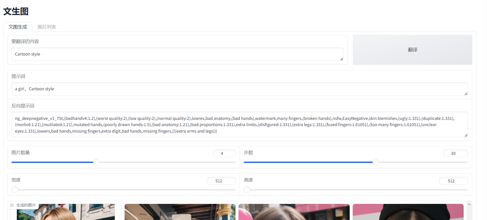
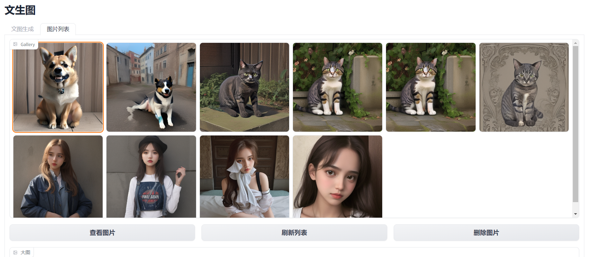

# 老雷的AI绘图工具

    利用SD相关模型进行图片创作，一个简单的绘图应用。自带翻译功能，支持保存图片，浏览历史图片。

## 预览

# 安装方法

环境依赖

py310+pytorch 

https://pytorch.org/get-started/locally/ 

git clone https://github.com/lrjxgl/aidraw.git

cd aidraw

pip install -r requirements.txt

# 运行方法

python gradio_app.py

设置AI模型

python gradio_app.py --engine sdxl

    